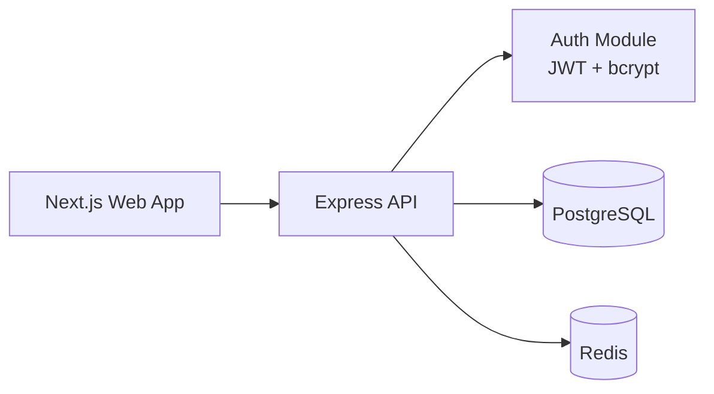

# CloudPulse – Step 1 (Monorepo + Backend Auth)

This repository now includes the Step 1 MVP foundation:

- Monorepo structure (`apps/*`, `packages/*`)
- Express API with secure auth (JWT + bcrypt)
- PostgreSQL schema (Prisma + SQL migration)
- Next.js 14 + Tailwind starter frontend
- Docker Compose for PostgreSQL and Redis

## 1) Start dependencies

```bash
docker compose up -d
```

## 2) Install packages

```bash
npm install
```

## 3) Configure environment

```bash
cp .env.example .env
```

## 4) Generate Prisma client + run migration

```bash
npm run prisma:generate --workspace @cloudpulse/db
npm run prisma:migrate --workspace @cloudpulse/db
```

## 5) Run app

```bash
npm run dev
```

- API: `http://localhost:4000`
- Web: `http://localhost:3000`

## Auth endpoints

- `POST /api/auth/register`
- `POST /api/auth/login`
- `GET /api/auth/me` (Bearer token)

## Architecture (Step 1)


