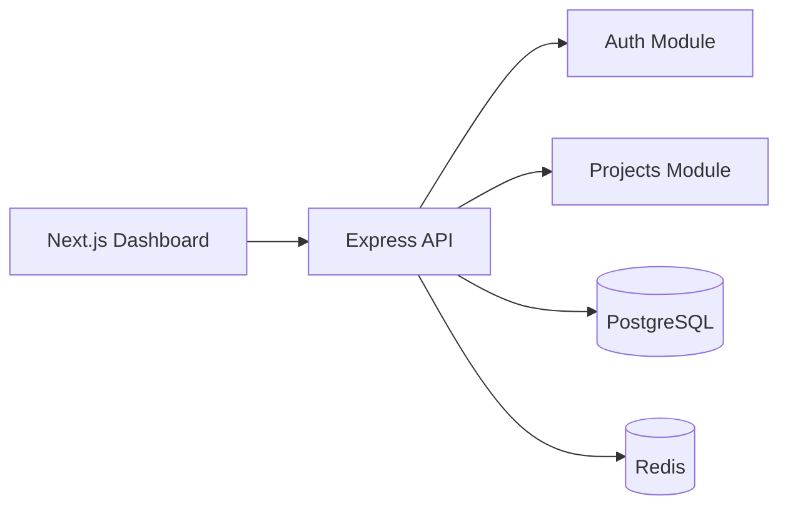

# CloudPulse – Step 2 (Projects API + Dashboard)

This repository now includes Step 1 + Step 2:

- Monorepo structure (`apps/*`, `packages/*`)
- Express API with auth (JWT + bcrypt) **+ project CRUD**
- PostgreSQL schema (Prisma + SQL migration)
- Next.js 14 + Tailwind **dashboard with auth pages**
- Docker Compose for PostgreSQL and Redis

## 1) Start dependencies

```bash
docker compose up -d
```

## 2) Install packages

```bash
npm install
```

## 3) Configure environment

```bash
cp .env.example .env
# Edit .env → set JWT_SECRET (≥32 chars)
```

## 4) Generate Prisma client + run migration

```bash
npm run prisma:generate --workspace @cloudpulse/db
npm run prisma:migrate --workspace @cloudpulse/db
```

## 5) Run app

```bash
npm run dev
```

- API: `http://localhost:4000`
- Web: `http://localhost:3000`

## Auth endpoints

- `POST /api/auth/register` – create account
- `POST /api/auth/login` – sign in
- `GET /api/auth/me` – current user (Bearer token)

## Project endpoints (all require Bearer token)

- `POST /api/projects` – create project
- `GET /api/projects` – list user's projects
- `GET /api/projects/:id` – project detail
- `PATCH /api/projects/:id` – update project
- `DELETE /api/projects/:id` – delete project

## Frontend pages

- `/` – auto-redirect to dashboard or login
- `/login` – sign in
- `/register` – create account
- `/dashboard` – projects list + create
- `/dashboard/projects/:id` – project detail

## Architecture (Step 2)


