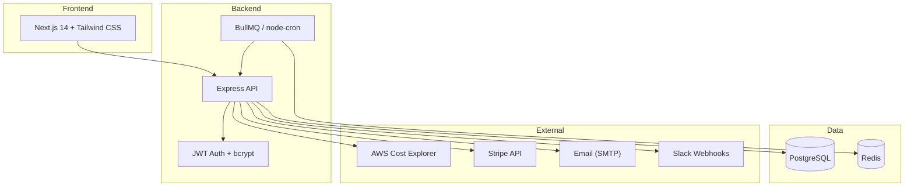

# CloudPulse — Cloud Cost Monitoring Dashboard

A full-stack SaaS application for monitoring and comparing cloud infrastructure costs. Track AWS spend across projects, set budget alerts, detect cost spikes, and compare spending patterns — all in a polished dark-mode dashboard.

## Features

- **Multi-project cost tracking** — Organize cloud accounts into projects
- **Interactive dashboard** — Overview with spend cards, trend charts, and service breakdowns
- **Cost comparison** — Side-by-side project comparison with distribution charts, daily trends, and auto-generated insights
- **Budget alerts** — Daily/monthly budget thresholds with email and Slack notifications
- **Spike detection** — Automatic detection of unusual spending vs 7-day average
- **Stripe billing** — FREE and PRO plans with checkout and customer portal
- **Background workers** — Scheduled cost fetching every 6 hours (BullMQ with cron fallback)
- **Encrypted credentials** — AWS access keys stored with AES-256-GCM encryption

## Architecture


```mermaid
flowchart TB
    subgraph Frontend
        Next["Next.js 14 + Tailwind CSS"]
    end
    subgraph Backend
        Express["Express API"]
        Auth["JWT Auth + bcrypt"]
        Workers["BullMQ / node-cron"]
    end
    subgraph Data
        PG[(PostgreSQL)]
        Redis[(Redis)]
    end
    subgraph External
        AWS["AWS Cost Explorer"]
        Stripe["Stripe API"]
        SMTP["Email (SMTP)"]
        Slack["Slack Webhooks"]
    end

    Next --> Express
    Express --> Auth
    Express --> PG
    Workers --> Redis
    Workers --> Express
    Express --> AWS
    Express --> Stripe
    Express --> SMTP
    Express --> Slack
```

## Tech Stack

| Layer | Technology |
|-------|------------|
| Frontend | Next.js 14, React, Tailwind CSS |
| Backend | Express, TypeScript, Zod validation |
| Database | PostgreSQL (Prisma ORM) |
| Queue | BullMQ (Redis) with node-cron fallback |
| Auth | JWT + bcrypt (12 rounds) |
| Encryption | AES-256-GCM for cloud credentials |
| Billing | Stripe (checkout, portal, webhooks) |
| Cloud | AWS Cost Explorer API + STS role assumption |

## Quick Start

### 1. Start dependencies

```bash
docker compose up -d
```

### 2. Install packages

```bash
npm install
```

### 3. Configure environment

```bash
cp .env.example .env
```

Required variables:
- `DATABASE_URL` — PostgreSQL connection string
- `JWT_SECRET` — At least 32 characters
- `ENCRYPTION_KEY` — 64-char hex string (256-bit). Generate with: `node -e "console.log(require('crypto').randomBytes(32).toString('hex'))"`

Optional:
- `REDIS_URL` — Defaults to `redis://localhost:6379`
- `STRIPE_SECRET_KEY`, `STRIPE_WEBHOOK_SECRET` — For billing features
- `SMTP_HOST`, `SMTP_PORT`, `SMTP_USER`, `SMTP_PASS` — For email alerts

### 4. Generate Prisma client + run migrations

```bash
npm run prisma:generate --workspace @cloudpulse/db
npm run prisma:migrate --workspace @cloudpulse/db
```

### 5. Run the app

```bash
npm run dev
```

- **API**: http://localhost:4000
- **Web**: http://localhost:3000
- **API Docs**: http://localhost:4000/api/docs

## API Endpoints

### Auth
| Method | Endpoint | Description |
|--------|----------|-------------|
| POST | `/api/auth/register` | Create account |
| POST | `/api/auth/login` | Sign in |
| GET | `/api/auth/me` | Current user profile |
| PUT | `/api/auth/me` | Update profile |
| PUT | `/api/auth/me/password` | Change password |

### Projects
| Method | Endpoint | Description |
|--------|----------|-------------|
| POST | `/api/projects` | Create project |
| GET | `/api/projects` | List projects |
| GET | `/api/projects/:id` | Project detail |
| PATCH | `/api/projects/:id` | Update project |
| DELETE | `/api/projects/:id` | Delete project |

### Cloud Accounts
| Method | Endpoint | Description |
|--------|----------|-------------|
| POST | `/api/cloud-accounts` | Add cloud account |
| GET | `/api/cloud-accounts?projectId=` | List accounts |
| DELETE | `/api/cloud-accounts/:id` | Remove account |

### Costs
| Method | Endpoint | Description |
|--------|----------|-------------|
| POST | `/api/costs/fetch` | Trigger cost fetch |
| GET | `/api/costs?cloudAccountId=` | Get cost records |
| GET | `/api/costs/summary/:projectId` | Cost summary |
| GET | `/api/costs/compare?projectIds=&days=` | Batch compare |

### Alerts
| Method | Endpoint | Description |
|--------|----------|-------------|
| POST | `/api/alerts` | Create alert rule |
| GET | `/api/alerts?projectId=` | List alert rules |
| PATCH | `/api/alerts/:id` | Update rule |
| DELETE | `/api/alerts/:id` | Delete rule |
| GET | `/api/alerts/history?projectId=` | Alert history |

### Billing
| Method | Endpoint | Description |
|--------|----------|-------------|
| GET | `/api/stripe/subscription` | Current plan |
| POST | `/api/stripe/checkout` | Upgrade to PRO |
| POST | `/api/stripe/portal` | Manage subscription |

## Frontend Pages

| Path | Description |
|------|-------------|
| `/` | Landing page |
| `/login` | Sign in |
| `/register` | Create account |
| `/dashboard` | Projects overview + cost insights |
| `/dashboard/projects/:id` | Project detail (overview, accounts, alerts) |
| `/dashboard/compare` | Side-by-side project comparison |
| `/dashboard/billing` | Subscription management |
| `/dashboard/activity` | Activity log |
| `/dashboard/settings` | Profile and password settings |

## Project Structure

```
cloudpulse-monorepo/
├── apps/
│   ├── server/          # Express API
│   │   └── src/
│   │       ├── config/      # Env validation (Zod)
│   │       ├── lib/         # Prisma, Redis, Logger, Encryption, Swagger
│   │       ├── middleware/  # Auth, rate-limit, plan-limits, error-handler
│   │       ├── modules/     # auth, projects, cloud-accounts, aws, alerts, stripe, activity
│   │       └── workers/     # BullMQ worker, cron scheduler, shared job logic
│   └── web/             # Next.js frontend
│       ├── app/             # Pages and layouts
│       ├── components/      # Shared components
│       ├── contexts/        # AuthContext
│       └── lib/             # API client
├── packages/
│   ├── db/              # Prisma schema + migrations + seeds
│   └── types/           # Shared TypeScript types
├── docker-compose.yml   # PostgreSQL + Redis
└── .editorconfig        # Formatting rules
```

## License

Private — All rights reserved.
